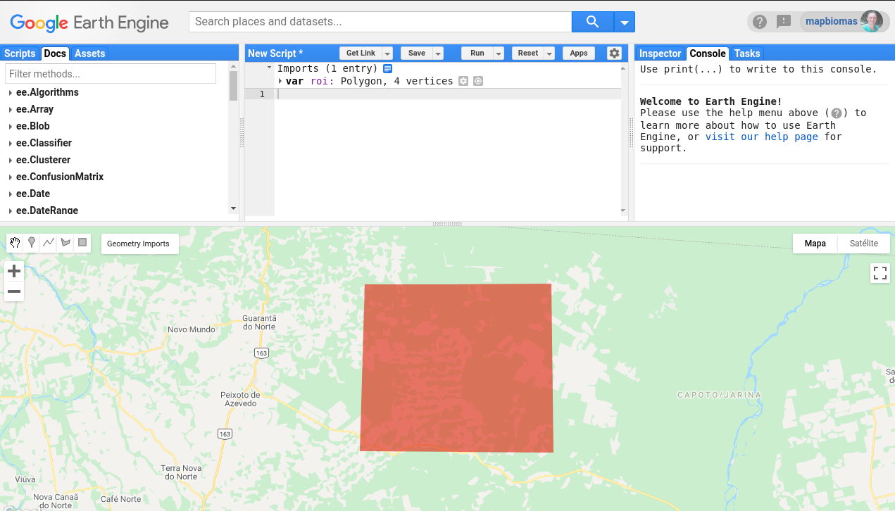

<div class="fluid-row" id="header">
    
    <h1 class="title toc-ignore">MapBiomas Princeton Course</h1>
    <h4 class="author"><em>Tasso Azevedo, Cesar Diniz, Luiz Cortinhas and João Siqueira</em></h4>
</div>

# 1. Creating a mosaic

## 1.1 Creating a region of interest (ROI)
Para este exemplo, precisamos definir uma região de interesse utilizando o painel de edição de geometrias do code editor. Abra o [code editor](https://code.earthengine.google.com/), selecione a opção `desenhar forma` e crie um polígono. Atenção para não criar um polígono muito grande, pois isso pode atrasar a execução deste tutorial. Neste exemplo, vamos mudar o nome da geometria para `roi`. 


[Link](https://code.earthengine.google.com/1e15221cf1d601e3d1a881b11421a062)

## 1.2 Getting an image collection
```javascript
/**
 * Create a Landsat 8 surface reflectance collection, filter by location and date
 */

// Landsat 8 SR collection id
var collectionId = "LANDSAT/LC08/C01/T1_SR";

// Create a collection filtering by ROI and date
var collection = ee.ImageCollection(collectionId)
    .filterBounds(roi)
    .filterDate('2020-01-01', '2020-12-31');

// prints the collection structure
print('Initial collection:', collection);
```
[Link](https://code.earthengine.google.com/11a7b5b5aea57c3e335d80cceea93ff4)

O resultado é a impressão no console de informações sobre a coleção filtrada.


## 1.3 Filtering by cloud cover percentage
Podemos filtrar as imagens de uma coleção usando qualquer informação contida no metadado das imagens. Neste exemplo, vamos utilizar a propriedade `CLOUD_COVER`. Esta propriedade armazena o percentual de cobertura de nuvens detectado pelo algoritmo do USGS.
```javascript
// Filter images with less than 50% of cloud cover
collection = collection
    .filterMetadata('CLOUD_COVER', 'less_than', 50);

// prints the collection structure
print('Images with less than 50% of cloud cover:', collection);
```
[Link](https://code.earthengine.google.com/eee987609a5988f7952495653a1721a8)

## 1.4 Selecting bands

Vamos utilizar neste exemplo as bandas `red, green, blue, nir, swir 1 e swir 2` que estão respectivamente nomeadas como `B2, B3, B4, B5, B6, B7`. É necessário selecionar a banda de qualidade também `pixel_qa`, pois vamos utiliza-lá mais adiante para remover as nuvens.
```javascript
var bandNames = ['B2','B3','B4','B5','B6','B7','pixel_qa'];

// Select bands of interest
collection = collection.select(bandNames);

// prints the collection structure
print('Images with selected bands:', collection);
```
[Link](https://code.earthengine.google.com/f7c1d2d42402f418ad24082387298413)

## 1.5 Adding data to map
Vamos dar uma olhada no mapa como está a nossa coleção.

```javascript
var visParams = {
    bands: ['B6', 'B5', 'B4'],
    gain: [0.08,0.06,0.2]
};

Map.addLayer(collection, visParams, 'collection');
```


[Link](https://code.earthengine.google.com/577ed08b58ab11c50ecbf0644d486468)