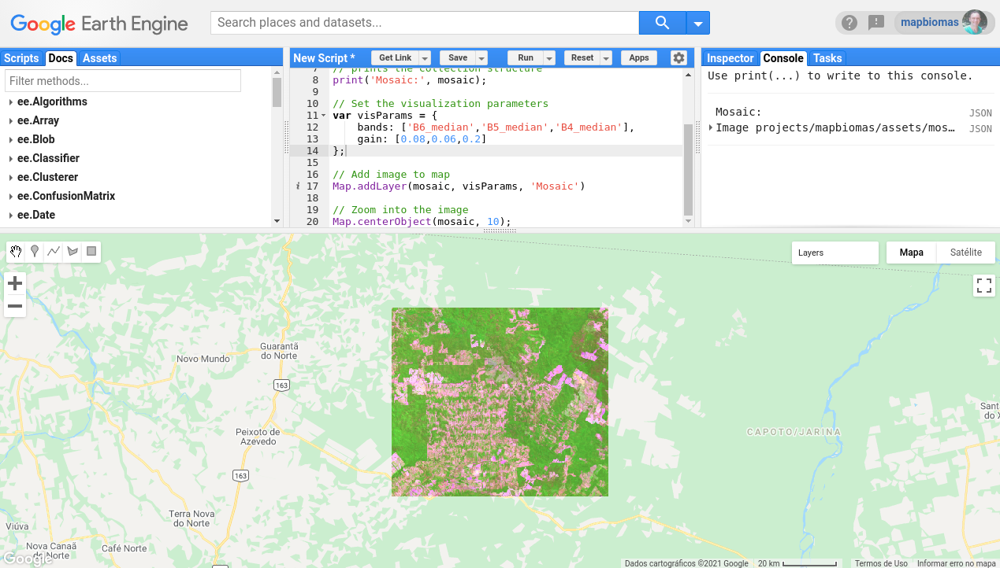

<div class="fluid-row" id="header">
    
    <h1 class="title toc-ignore">MapBiomas Princeton Course</h1>
    <h4 class="author"><em>Tasso Azevedo, Cesar Diniz, Luiz Cortinhas and João Siqueira</em></h4>
</div>

# 2. Classification using Random Forest
Nesta sessão vamos aprender a carregar uma imagem, coletar amostras, treinar um modelo random forest e executar a classifiação.

## 2.1. Load mosaic
```javascript
// Image asset id
var imageId = "projects/mapbiomas/assets/mosaic-2020";

// Load as an image
var mosaic = ee.Image(imageId);

// prints the collection structure
print('Mosaic:', mosaic);
```

## 2.2. Add mosaic to map
```javascript
// Set the visualization parameters
var visParams = {
    bands: ['B6_median','B5_median','B4_median'],
    gain: [0.08,0.06,0.2]
};

// Add image to map
Map.addLayer(mosaic, visParams, 'Mosaic');

// Zoom into the image
Map.centerObject(mosaic, 9);
```

<a href="https://code.earthengine.google.com/a0651d74137aec7017cb6c027e17ddd9" target="_blank">Link</a>

## 2.2. Collect manual samples
### 2.2.1. Create a feature collection

Neste exemplo, vamos mapear três classes: `vegetação, não vegetação e água`. Para isso, é necessário coletar amostras para cada uma das classes. Utilizando a ferramenta de edição de polígonos do code editor, vamos criar três conjuntos de geometrias do tipo `polígono` e importá-las como `FeatureCollection`. Também vamos adicionar um nome para cada conjunto de geometrias. O script está preparado para aceitar os nomes: `vegetation`, `notVegetation` e `water`. Em cada conjunto será adicionado uma propriedade chamada `class` que receberá valor 1, 2 ou 3 para vegetation, notVegetation e water respectivamente. Vocês poderão escolher uma cor de referência para cada class. Veja a figura abaixo mostrando o painel de configurações das geometrias:


### 2.2.2. Merge the feature collections

Para utilizar as feature collections no treinamento do classificador é necessário unir os três conjuntos em uma única coleção. Preste ateção que até aqui ainda não temos dados armazenados em nenhuma das três feature collections.

```javascript
// Merge all samples into a featureCollection
var samples = vegetation.merge(notVegetation).merge(water);
```

### 2.2.2. Collect the samples

[Link](https://code.earthengine.google.com/77a6c53208de1eb68dc43d5442b10e00{:target="_blank"})

Agora vamos sortear pontos aleatórios dentro dos polígonos que coletamos, pois o treinamento do classificador se faz 

```javascript
// Merge all samples into a featureCollection
var samples = vegetation.merge(notVegetation).merge(water);
```