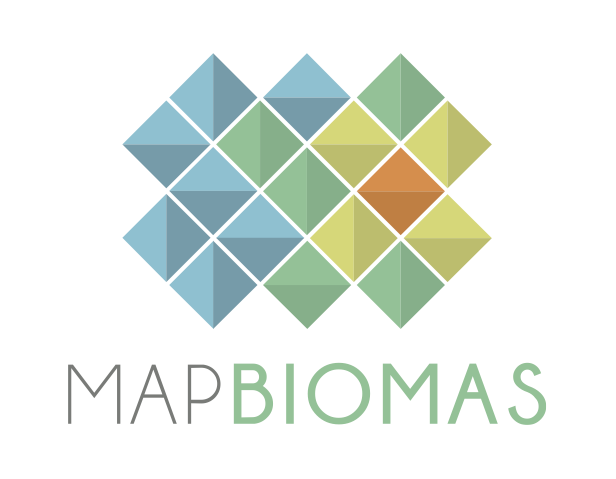

    
    <h1 class="title toc-ignore">MapBiomas Training - ENG</h1>
    <h4 class="author"><em>Cesar Diniz, João Siqueira, Luiz Cortinhas, Luize Pinheiro and Tasso Azevedo</em></h4>

# MapBiomas Bakground
The Mapbiomas Project consists of a collaborative network of specialists in the fileds of remote sensing, GIS, land-use, biomes, and computer science who rely on the Google Earth Engine platform and its cloud computing capabilities to produce annual land use and land cover maps from Brazil. The whole project runs based on machine learning supervised classifiers.

# Day 1: MapBiomas presentation (by Tasso Azevedo)
Presentation: https://drive.google.com/drive/folders/1tLAhG2go-jBCBcgj4-wIJYS0PxY4dk_X?usp=sharing
Step-by-Step: https://docs.google.com/presentation/d/11OF8NnMTmcbni51zNznvbisp0ROD8jCM2pBtaEs1epk/edit#slide=id.p1

[Next: Day 2 - Accessing Satellite Images and Creating Mosaics](https://github.com/mapbiomas-brazil/mapbiomas-training/tree/main/MapBiomas_101/Day_2/README.md)
