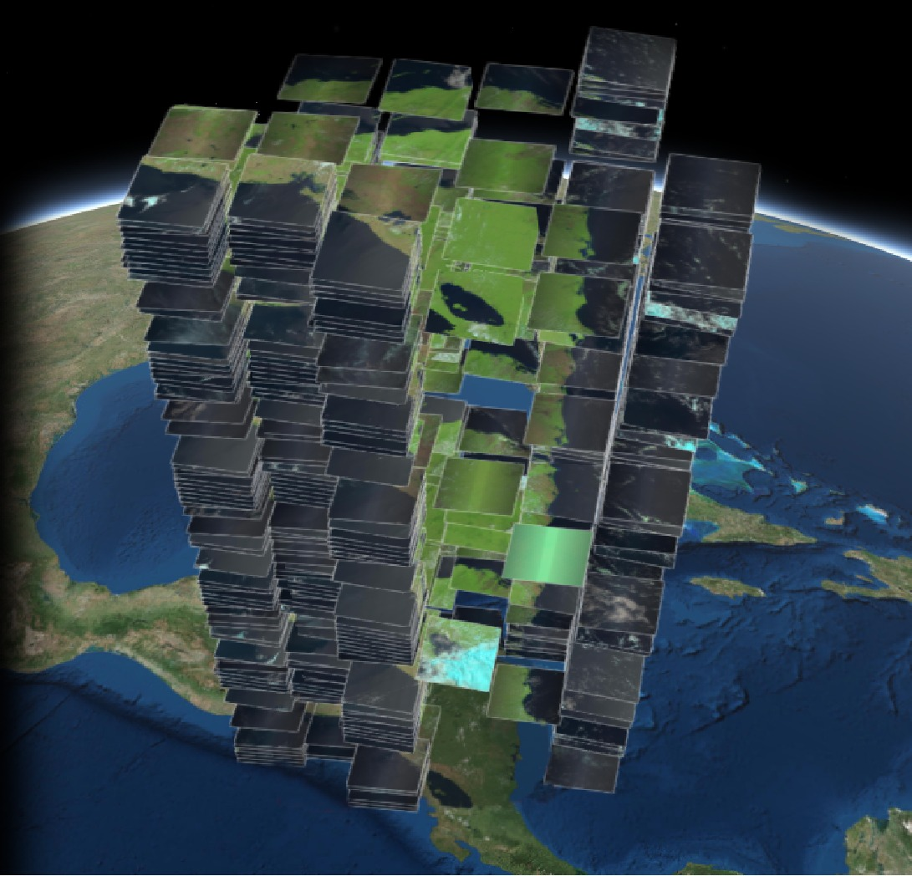

<div class="fluid-row" id="header">
    
    <h1 class="title toc-ignore">MapBiomas Training - ENG</h1>
    <h4 class="author"><em>Tasso Azevedo, Cesar Diniz, Luiz Cortinhas and João Siqueira</em></h4>
</div>

# Concepts of the Day
**Image Collection**: As straightforward as it could be, it is a collection of images. You may think of it as a pile of images. The Z-axis represents time, X-axis and Y-axis represent the Earth's surface.

<p align="center">
    
</p>

**Mosaic**: A mosaic is a combination or merging of two or more matrices. Any given mosaic can be a multiband or single-band mosaic. The MapBiomas project works with the concept of multiband mosaics.

<p align="center">
    
</p>

**Landsat Bit Values**: The Landsat satellites are a family of distinct satellite missions. Each family has its digital characteristics, one of which is the 'bit value' QA Bands. The bit values are a digital parameters that can be used to group out specific pixel characteristics. The QA Bit Values will group the Landsat pixels as belonging to .  Note: Numerically speaking, any number in our screen is originally a binary number (0 or 1).

<div align=center>
    <table class="table table-striped">
        <caption>
            <h4><strong>Landsat Surface Reflectance-Derived Spectral Indices Pixel Quality Band: Landsat 8</strong></h4>
        </caption>
        <thead>
        </thead>
        <tbody style="font-size:12px;">
            <tr class="alt">
                <td colspan="100">
                    <ul>
                        <li>
                            Bit 0: Fill
                            <ul>
                            </ul>
                        </li>
                        <li>
                            Bit 1: Dilated Cloud
                            <ul>
                            </ul>
                        </li>
                        <li>
                            Bit 2: Cirrus (high confidence)
                            <ul>
                            </ul>
                        </li>
                        <li>
                            Bit 3: Cloud
                            <ul>
                            </ul>
                        </li>
                        <li>
                            Bit 4: Cloud Shadow
                            <ul>
                            </ul>
                        </li>
                        <li>
                            Bit 5: Snow
                            <ul>
                            </ul>
                        </li>
                        <li>
                            Bit 6: Clear
                            <ul>
                                <li>0: Cloud or Dilated Cloud bits are set</li>
                                <li>1: Cloud and Dilated Cloud bits are not set</li>
                            </ul>
                        </li>
                        <li>
                            Bit 7: Water
                            <ul>
                            </ul>
                        </li>
                        <li>
                            Bits 8-9: Cloud Confidence
                            <ul>
                                <li>0: None</li>
                                <li>1: Low</li>
                                <li>2: Medium</li>
                                <li>3: High</li>
                            </ul>
                        </li>
                        <li>
                            Bits 10-11: Cloud Shadow Confidence
                            <ul>
                                <li>0: None</li>
                                <li>1: Low</li>
                                <li>2: Medium</li>
                                <li>3: High</li>
                            </ul>
                        </li>
                        <li>
                            Bits 12-13: Snow/Ice Confidence
                            <ul>
                                <li>0: None</li>
                                <li>1: Low</li>
                                <li>2: Medium</li>
                                <li>3: High</li>
                            </ul>
                        </li>
                        <li>
                            Bits 14-15: Cirrus Confidence
                            <ul>
                                <li>0: None</li>
                                <li>1: Low</li>
                                <li>2: Medium</li>
                                <li>3: High</li>
                            </ul>
                        </li>
                    </ul>
                    </devsite-expandable>
                </td>
            </tr>
        </tbody>
    </table>
</div>


**Vegetation and Water Index**: A Vegetation Index (VI) or Water Index (WI) are spectral transformations of two or more bands designed to enhance the contribution of vegetation/water properties in a given satellite data.

<p align="center">
    
</p>

# 1. Creating a mosaic

## 1.1 Creating a region of interest (ROI)
For this example, we need to define a region of interest using the geometry editing panel on code editor interface. Open the code editor, click on the "draw a shape" button and draw a polygon anywhere in the planet. Be careful not to draw a too large extension, try something around 100km x 100km. The processing of large extensions may delay the execution of this tutorial. In this example, we will change the name of the geometry to  `roi`. 


[Link](https://code.earthengine.google.com/1e15221cf1d601e3d1a881b11421a062)

## 1.2 Getting an image collection
```javascript
/**
 * Create a Landsat 8 surface reflectance collection, filter by location and date
 */

// Landsat 8 SR collection id
var collectionId = "LANDSAT/LC08/C02/T1_L2";

// Create a collection filtering by ROI and date
var collection = ee.ImageCollection(collectionId)
    .filterBounds(roi)
    .filterDate('2020-01-01', '2020-12-31');

// prints the collection structure
print('Initial collection:', collection);
```
[Link](https://code.earthengine.google.com/087c341602e84a934de6c7e33ff4cda1)

The result of the filtered collection is shown on the console.

<p align="center">
    
</p>

## 1.3 Filtering by cloud cover percentage

We can filter the images inside an Image Collection using any information contained in the image's metadata. In this example, we will use the `CLOUD_COVER` property. This property stores the percentage of cloud cover detected by the USGS algorithm.

```javascript
// Filter images with less than 50% of cloud cover
collection = collection
    .filterMetadata('CLOUD_COVER', 'less_than', 50);

// prints the collection structure
print('Images with less than 50% of cloud cover:', collection);
```
[Link](https://code.earthengine.google.com/6b1928ec388a9cc8b9a608a8a67369e6)

## 1.4 Appling scale factor

```javascript
// Applies scaling factors.
function applyScaleFactors(image) {
    // Select every optical bands and applies scaling factor
    var opticalBands = image.select('SR_B.')
        .multiply(0.0000275)
        .add(-0.2)
        .multiply(10000);
    
    // Select every thermal bands and applies scaling factor
    var thermalBands = image.select('ST_B.*')
        .multiply(0.00341802)
        .add(149.0);
    
    return image.addBands(opticalBands, null, true)
                .addBands(thermalBands, null, true);
}

collection = collection.map(applyScaleFactors);

print('Images reescaled:', collection);
```
[Link](https://code.earthengine.google.com/ddf75cfb2d5bf096071c4096f095989c)

## 1.5 Selecting bands

In this example we will use the bands `blue, green, red, nir, swir 1 and swir 2` which are respectively named` B2, B3, B4, B5, B6, B7`. It is necessary to select the quality band also, `pixel_qa`, as it will be used later to remove the clouds and shadows.

```javascript
var bandNames = ['SR_B2','SR_B3','SR_B4','SR_B5','SR_B6','SR_B7','QA_PIXEL'];

// Select bands of interest
collection = collection.select(bandNames);

// prints the collection structure
print('Images with selected bands:', collection);
```
[Link](https://code.earthengine.google.com/3f4e20a5e6775b9da8a19011f8773aa8)


## 1.6 Adding data to map
Let's take a look in our selection and see how our collection is visually represented. Right now, we still have cloud pixels inseid our 'roi'. We can use the `inspector` to check the pixel values of the images. Do your inspection!!

```javascript
// Set a visualization parameters object
var visParams = {
    bands: ['SR_B6', 'SR_B5', 'SR_B4'],
    gain: [0.08,0.06,0.2]
};

// Add collection to map
Map.addLayer(collection, visParams, 'collection');
```


[Link](https://code.earthengine.google.com/3ab5fc975c1b105426c795215c0db926)

## 1.7 Removing clouds and shadows
Here we are going to show a simple way to remove clouds from Landsat images. This technique is very simple and must be combined with other more complex algorithms to generate a better result.

### 1.7.1 Define a cloud masking function

```javascript
/**
 * @name
 *      cloudMasking
 * @description
 *      Removes clouds and shadows using the pixel_qa band
 * @argument
 *      ee.Image with pixel_qa band
 * @returns
 *      ee.Image without clouds
 */
var cloudMasking = function (image) {

    var qaBand = image.select(['QA_PIXEL']);

    var cloud = qaBand.bitwiseAnd(Math.pow(2, 3)).not(); 
    var cloudEdge = qaBand.bitwiseAnd(Math.pow(2, 1)).not(); 
    var shadow = qaBand.bitwiseAnd(Math.pow(2, 4)).not(); 
    
    image = image.updateMask(cloud);
    image = image.updateMask(cloudEdge);
    image = image.updateMask(shadow);
    
    return image;
};
```
:question: What exactly is `bitwiseAnd()` function doing?

### 1.7.2 Apply the cloud masking function to each image

```javascript
var collectionWithoutClouds = collection.map(cloudMasking);

Map.addLayer(collectionWithoutClouds, visParams, 'collection without clouds');

print('Collection without clouds:', collectionWithoutClouds);
```


[Link](https://code.earthengine.google.com/3369cfdfe56790fc6c0e703907208a97)

## 1.8 Calculate NDVI, EVI and NDWI for each image
### 1.8.1 Defining NDVI, EVI and NDWI functions
```javascript
/**
 * @name
 *      computeNDVI
 * @description
 *      Calculates NDVI index
 */
var computeNDVI = function (image) {

	var exp = '( b("SR_B5") - b("SR_B4") ) / ( b("SR_B5") + b("SR_B4") )';

	var ndvi = image.expression(exp).rename("ndvi");

	return image.addBands(ndvi);
};

/**
 * @name
 *      computeNDWI
 * @description
 *      Calculates NDWI index
 */
var computeNDWI = function (image) {

	var exp = 'float(b("SR_B5") - b("SR_B6"))/(b("SR_B5") + b("SR_B6"))';

	var ndwi = image.expression(exp).rename("ndwi");

	return image.addBands(ndwi);
};

/**
 * @name
 *      computeEVI
 * @description
 *      Calculates EVI index
 */
var computeEVI = function (image) {

	var exp = '2.5 * ((b("SR_B5") - b("SR_B4")) / (b("SR_B5") + 6 * b("SR_B4") - 7.5 * b("SR_B2") + 1))';

	var evi = image.expression(exp).rename("evi");

	return image.addBands(evi);

};
```

### 1.8.2 Apply the functions to each image

```javascript
// For each image, apply the functions computeNDVI, computeNDWI and computeEVI.
var collectionWithIndexes = collectionWithoutClouds
    .map(computeNDVI)
    .map(computeNDWI)
    .map(computeEVI);

// Sets a visualization parameter object to NDVI data
var visNdvi = {
    bands: ['ndvi'],
    min: 0,
    max: 1,
    palette: 'ff0000,ffff00,00aa00',
    format: 'png'
};

Map.addLayer(collectionWithIndexes, visNdvi, 'collection with indexes');

print('collection with indexes:', collectionWithIndexes);
```

[Link](https://code.earthengine.google.com/49448f8b1a3d60d198f6b2c30f7e91bd)

## 1.9 Make the median, minimum and maximum mosaics

```javascript
// Generate median, minimum and maximum mosaics.
var median = collectionWithIndexes.reduce(ee.Reducer.median());
var minimum = collectionWithIndexes.reduce(ee.Reducer.min());
var maximum = collectionWithIndexes.reduce(ee.Reducer.max());
```
<p align="center">
    
</p>

[Link](https://code.earthengine.google.com/f9fdf5c78cc6cd1690203a6221ef13e7)

## 1.10 Make the final mosaic

```javascript
// Merges the median, minimum and maximum mosaics
var mosaic = median.addBands(minimum).addBands(maximum);

// Sets a visualization parameter object to NDVI median
var visNdvi = {
    bands: ['ndvi_median'],
    min: 0,
    max: 1,
    palette: 'ff0000,ffff00,00aa00',
    format: 'png'
};

// Sets false color visualization parameter object
var visFalseColor = {
    bands: ['SR_B6_median', 'SR_B5_median', 'SR_B4_median'],
    gain: [0.08, 0.06, 0.2],
    gamma: 0.85
};

// Add median mosaic to map
Map.addLayer(mosaic, visFalseColor, 'False color');
Map.addLayer(mosaic, visNdvi, 'NDVI median mosaic');

print('final mosaic:', mosaic);
```

[Link](https://code.earthengine.google.com/98ad795ac2424ea37fa03e879f366fda)

## 1.11 Export mosaic to GEE asset

```javascript
// Export the mosaic to your asset
Export.image.toAsset({
    image: mosaic, 
    description: 'mosaic-2020', 
    assetId: 'mosaic-2020', 
    pyramidingPolicy: {'.default': 'mean'}, 
    region: roi, 
    scale: 30, 
    maxPixels: 1e13
});
```
[Link](https://code.earthengine.google.com/13878f05742dbff4ce448d0855ea22a5)

[Previous: Day 1 - MapBiomas presentation](https://github.com/mapbiomas-brazil/mapbiomas-training/tree/main/MapBiomas_101/Day_1/README.md) | [Next: Day 3 - Classification using Random Forest](https://github.com/mapbiomas-brazil/mapbiomas-training/tree/main/MapBiomas_101/Day_3/README.md)

