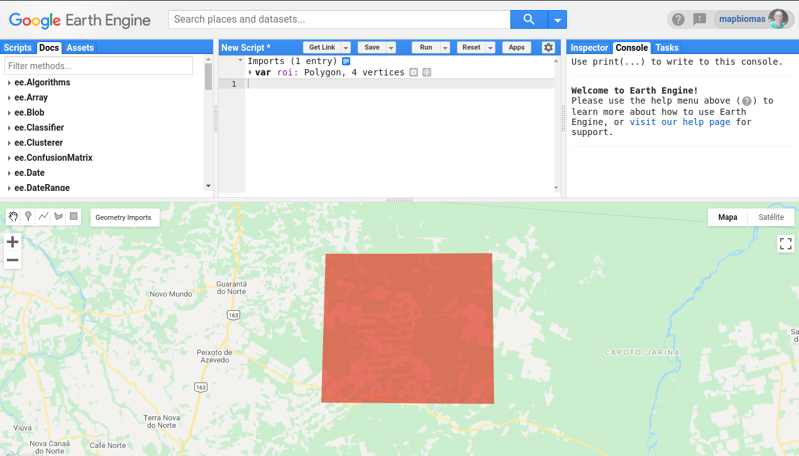

<div class="fluid-row" id="header">
    
    <h1 class="title toc-ignore">MapBiomas Princeton Course</h1>
    <h4 class="author"><em>Tasso Azevedo, Cesar Diniz, Luiz Cortinhas and João Siqueira</em></h4>
</div>

# Concepts of the Day

`Mosaic`: A mosaic is a combination or merging of two or more matrices. Any given mosaic can be a multiband or single-band mosaic. The MapBiomas project works with the concept of multiband mosaics.

<p align="center">
    
</p>

`Landsat Bit Values`: The Landsat satellites are a family of distinct satellite missions. Each family has its digital characteristics, one of which is the 'bit value' QA Bands. The bit values are a digital parameters that can be used to group out specific pixel characteristics. The QA Bit Values will group the Landsat pixels as belonging to .  Note: Numerically speaking, any number in our screen is originally a binary number (0 or 1).  

`Vegetation and Water Index`: A Vegetation Index (VI) or Water Index (WI) are spectral transformations of two or more bands designed to enhance the contribution of vegetation/water properties in a given satellite data.

<p align="center">
    
</p>

# 1. Creating a mosaic

## 1.1 Creating a region of interest (ROI)
For this example, we need to define a region of interest using the geometry editing panel on code editor interface. Open the code editor, click on the "draw a shape" button and draw a polygon anywhere in the planet. Be careful not to draw a too large extension, try something around 100km x 100km. The processing of large extensions may delay the execution of this tutorial. In this example, we will change the name of the geometry to  `roi`. 


[Link](https://code.earthengine.google.com/1e15221cf1d601e3d1a881b11421a062)

## 1.2 Getting an image collection
```javascript
/**
 * Create a Landsat 8 surface reflectance collection, filter by location and date
 */

// Landsat 8 SR collection id
var collectionId = "LANDSAT/LC08/C01/T1_SR";

// Create a collection filtering by ROI and date
var collection = ee.ImageCollection(collectionId)
    .filterBounds(roi)
    .filterDate('2020-01-01', '2020-12-31');

// prints the collection structure
print('Initial collection:', collection);
```
[Link](https://code.earthengine.google.com/11a7b5b5aea57c3e335d80cceea93ff4)

The result of the filtered collection is shown on the console.


## 1.3 Filtering by cloud cover percentage
We can filter the images inside an Image Collection using any information contained in the image's metadata. In this example, we will use the `CLOUD_COVER` property. This property stores the percentage of cloud cover detected by the USGS algorithm.
```javascript
// Filter images with less than 50% of cloud cover
collection = collection
    .filterMetadata('CLOUD_COVER', 'less_than', 50);

// prints the collection structure
print('Images with less than 50% of cloud cover:', collection);
```
[Link](https://code.earthengine.google.com/eee987609a5988f7952495653a1721a8)

## 1.4 Selecting bands

In this example we will use the bands `blue, green, red, nir, swir 1 and swir 2` which are respectively named` B2, B3, B4, B5, B6, B7`. It is necessary to select the quality band also, `pixel_qa`, as it will be used later to remove the clouds and shadows.

```javascript
var bandNames = ['B2','B3','B4','B5','B6','B7','pixel_qa'];

// Select bands of interest
collection = collection.select(bandNames);

// prints the collection structure
print('Images with selected bands:', collection);
```
[Link](https://code.earthengine.google.com/f7c1d2d42402f418ad24082387298413)

## 1.5 Adding data to map
Let's take a look in our selection and see how our collection is visually represented. Right now, we still have cloud pixels inseid our 'roi'. We can use the `inspector` to check the pixel values of the images. Do your inspection!!

```javascript
// Set a visualization parameters object
var visParams = {
    bands: ['B6', 'B5', 'B4'],
    gain: [0.08,0.06,0.2]
};

// Add collection to map
Map.addLayer(collection, visParams, 'collection');
```


[Link](https://code.earthengine.google.com/577ed08b58ab11c50ecbf0644d486468)

## 1.6 Removing clouds
Here we are going to show a simple way to remove clouds from Landsat images. This technique is very simple and must be combined with other more complex algorithms to generate a better result.

### 1.6.1 Define a cloud masking function

```javascript
/**
 * @name
 *      cloudMasking
 * @description
 *      Removes clouds using the pixel_qa band
 * @argument
 *      ee.Image with pixel_qa band
 * @returns
 *      ee.Image without clouds
 */
var cloudMasking = function (image) {

    var qaBand = image.select(['pixel_qa']);

    var cloudMask = qaBand.bitwiseAnd(Math.pow(2, 5)).not(); 

    return image.mask(cloudMask);
};
```
:question: What exactly is `bitwiseAnd()` function doing?

### 1.6.2 Apply the cloud masking function to each image

```javascript
var collectionWithoutClouds = collection.map(cloudMasking);

Map.addLayer(collectionWithoutClouds, visParams, 'collection without clouds');

print('Collection without clouds:', collectionWithoutClouds);
```


[Link](https://code.earthengine.google.com/01842341e9e63e71523f9390611054b8)

## 1.7 Calculate NDVI, EVI and NDWI for each image
### 1.7.1 Defining NDVI, EVI and NDWI functions
```javascript
/**
 * @name
 *      getNDVI
 * @description
 *      Calculates NDVI index
 */
var getNDVI = function (image) {

	var exp = '( b("B5") - b("B4") ) / ( b("B5") + b("B4") )';

	var ndvi = image.expression(exp).rename("ndvi");

	return image.addBands(ndvi);
};

/**
 * @name
 *      getNDWI
 * @description
 *      Calculates NDWI index
 */
var getNDWI = function (image) {

	var exp = 'float(b("B5") - b("B6"))/(b("B5") + b("B6"))';

	var ndwi = image.expression(exp).rename("ndwi");

	return image.addBands(ndwi);
};

/**
 * @name
 *      getEVI
 * @description
 *      Calculates EVI index
 */
var getEVI = function (image) {

	var exp = '2.5 * ((b("B5") - b("B4")) / (b("B5") + 6 * b("B4") - 7.5 * b("B2") + 1))';

	var evi = image.expression(exp).rename("evi");

	return image.addBands(evi);

};
```

### 1.7.2 Apply the functions to each image

```javascript
// For each image, applies the functions getNDVI, getNDWI and getEVI.
var collectionWithIndexes = collectionWithoutClouds
    .map(getNDVI)
    .map(getNDWI)
    .map(getEVI);

// Sets a visualization parameter object to NDVI data
var visNdvi = {
    bands: ['ndvi'],
    min: 0,
    max: 1,
    palette: 'ff0000,ffff00,00aa00',
    format: 'png'
};

Map.addLayer(collectionWithIndexes, visNdvi, 'collection with indexes');

print('collection with indexes:', collectionWithoutClouds);
```

[Link](https://code.earthengine.google.com/85366a15f58cc21eb4a05ecf4a715a4b)

## 1.8 Make the median, minimum and maximum mosaics

```javascript
// Reduce collection to median, minimum and maximum values
var median = collectionWithIndexes.reduce(ee.Reducer.median());
var minimum = collectionWithIndexes.reduce(ee.Reducer.min());
var maximum = collectionWithIndexes.reduce(ee.Reducer.max());

// Sets a visualization parameter object to NDVI median
var visNdviIndex = {
    bands: ['ndvi_median'],
    min: 0,
    max: 1,
    palette: 'ff0000,ffff00,00aa00',
    format: 'png'
};

Map.addLayer(median, visNdviIndex, 'median mosaic');

print('median mosaic:', median);
```

[Link](https://code.earthengine.google.com/6b9b9d6d31a8be09db150d6ac6c69be8)

## 1.9 Make the final mosaic

```javascript
// Merges the median, minimum and maximum mosaics
var mosaic = median.addBands(minimum).addBands(maximum);

print('final mosaic:', mosaic);
```
[Link](https://code.earthengine.google.com/02f5deabea8edd04f52fa34b68dd00d7)

## 1.10 Export mosaic to GEE asset

```javascript
// Export the mosaic to your asset
Export.image.toAsset({
    image: mosaic, 
    description: 'mosaic-2020', 
    assetId: 'mosaic-2020', 
    pyramidingPolicy: {'.default': 'mean'}, 
    region: roi, 
    scale: 30, 
    maxPixels: 1e13
});
```
[Link](https://code.earthengine.google.com/730cbb39b8171afb16e62220c5cf5678)
