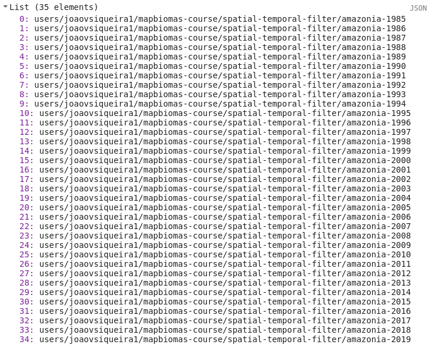

<div class="fluid-row" id="header">
    
    <h1 class="title toc-ignore">MapBiomas Princeton Course</h1>
    <h4 class="author"><em>Tasso Azevedo, Cesar Diniz, Luiz Cortinhas and João Siqueira</em></h4>
</div>

# Concepts of the Day

# 3. Post-classification

## 3.1 Spatial Filter
### 3.1.1 Load data

```javascript
// The asset name of classification data
var classificationId = 'users/joaovsiqueira1/mapbiomas-course/spatial-temporal-filter/amazonia-2019';

// Load image classification
var classification = ee.Image(classificationId);

// import the mapbiomas palettes module and get the 'classification5' color scheme
var palette = require('users/mapbiomas/modules:Palettes.js').get('classification5');

print(palette);

// Set a visualization parameter
var visClassification = {
    'min': 0,
    'max': 45,
    'palette': palette,
    'format': 'png'
};

// Add image to map
Map.addLayer(classification, visClassification, 'Classification 2019');
```

[Link](https://code.earthengine.google.com/6dc68d4352fe954eef137c45bd452cee)

### 3.1.2 Use the mapbiomas spatial filter code
Essa etapa não é um processo simples de se fazer, por isso teremos um código um pouco mais avançado aqui. O filtro espacial tem o objetivo de reclassificar pequenos grupos de pixels isolados usando a informação dos pixels vizinhos. Estes pixels isolados, em geral, passam pelo processo de rotulagem do classificador, mas por estarem num padrão espacial disperso acabam por não refletir o resultado esperado. O propósito desta técnica não é alterar o dado de classificação de uma forma significativa, mas trazer uma melhoria sútil ao mapa final. Vamos estudar o código abaixo.

```javascript
/**
 * Classe de pos-classificação para reduzir ruídos na imagem classificada
 * 
 * @param {ee.Image} image [eeObjeto imagem de classificação]
 *
 * @example
 * var image = ee.Image("aqui vem a sua imagem");
 * var filterParams = [
 *     {classValue: 1, maxSize: 3},
 *     {classValue: 2, maxSize: 5}, // o tamanho maximo que o mapbiomas está usado é 5
 *     {classValue: 3, maxSize: 5}, // este valor foi definido em reunião
 *     {classValue: 4, maxSize: 3},
 *     ];
 * var pc = new PostClassification(image);
 * var filtered = pc.spatialFilter(filterParams);
 */
var PostClassification = function (image) {

    this.init = function (image) {

        this.image = image;

    };

    var majorityFilter = function (image, params) {

        params = ee.Dictionary(params);
        var maxSize = ee.Number(params.get('maxSize'));
        var classValue = ee.Number(params.get('classValue'));

        // Generate a mask from the class value
        var classMask = image.eq(classValue);

        // Labeling the group of pixels until 100 pixels connected
        var labeled = classMask.mask(classMask).connectedPixelCount(maxSize, true);

        // Select some groups of connected pixels
        var region = labeled.lt(maxSize);

        // Squared kernel with size shift 1
        // [[p(x-1,y+1), p(x,y+1), p(x+1,y+1)]
        // [ p(x-1,  y), p( x,y ), p(x+1,  y)]
        // [ p(x-1,y-1), p(x,y-1), p(x+1,y-1)]
        var kernel = ee.Kernel.square(1);

        // Find neighborhood
        var neighs = image.neighborhoodToBands(kernel).mask(region);

        // Reduce to majority pixel in neighborhood
        var majority = neighs.reduce(ee.Reducer.mode());

        // Replace original values for new values
        var filtered = image.where(region, majority);

        return filtered.byte();

    };

    /**
     * Método para reclassificar grupos de pixels de mesma classe agrupados
     * @param  {list<dictionary>} filterParams [{classValue: 1, maxSize: 3},{classValue: 2, maxSize: 5}]
     * @return {ee.Image}  Imagem classificada filtrada
     */
    this.spatialFilter = function (filterParams) {

        var image = ee.List(filterParams)
            .iterate(
                function (params, image) {
                    return majorityFilter(ee.Image(image), params);
                },
                this.image
            );

        this.image = ee.Image(image);


        return this.image;

    };

    this.init(image);

};
```
[Link](https://code.earthengine.google.com/07a35e19beced17bad2935048a006f07)

Agora vamos ver como se usa o código do MapBiomas.

```javascript
// Set a list of spatial filter parameters
// classValue is the representative number of a class and maxSize is the maximum
// size of pixels in a group that will be reclassified
var filterParams = [
    {classValue: 3, maxSize: 5},
    {classValue: 15, maxSize: 5}, 
    {classValue: 33, maxSize: 5}, 
    {classValue: 19, maxSize: 5},
];

var pc = new PostClassification(classification);

var filtered = pc.spatialFilter(filterParams);

// Add image to map
Map.addLayer(filtered.reproject('EPSG:4326', null, 30), visClassification, 'Filtered 2019');
```
<div align=center>
    <caption>
        <h4><strong>Classification before spatial filter</strong></h4>
    </caption>
    <p align="center">
        
    </p>
    <caption>
        <h4><strong>Classification after spatial filter</strong></h4>
    </caption>
    <p align="center">
        
    </p>
</div>

[Link](https://code.earthengine.google.com/1237c86837a94fcc549d9d3e1adf59bb)

### 3.1.3 Export the filtered classification

Executamos esse procedimento para todos os mapas anuais do MapBiomas. Utilizamos algumas técnicas para otimizar o tempo de exportação das imagens. Algumas delas podem ser encontradas no nosso github.

```javascript
// Export the filtered classification to your asset
Export.image.toAsset({
    image: filtered, 
    description: 'filtered-2019', 
    assetId: 'filtered-2019', 
    pyramidingPolicy: {'.default': 'mode'},
    region: classification.geometry(), 
    scale: 30, 
    maxPixels: 1e13
});
```

## 3.2 Temporal Filter

Assim como o filtro espacial, o filtro temporal tem como objetivo reclassificar dados usando as informações de seus vizinhos. No entanto, o filtro temporal usa o pixel de uma data no passado e outro em uma data no futuro do pixel em análise. Neste exercício vamos usar uma série temporal de imagens classificadas para a coleção 5 do MapBiomas.

### 3.2.1 Acessing pre-processed MapBiomas data
:heavy_exclamation_mark: Start a new script.

```javascript
// List of years used in mapbiomas collection 5
var years = [
    '1985', '1986', '1987', '1988', '1989', '1990', '1991', '1992',
    '1993', '1994', '1995', '1996', '1997', '1998', '1999', '2000',
    '2001', '2002', '2003', '2004', '2005', '2006', '2007', '2008',
    '2009', '2010', '2011', '2012', '2013', '2014', '2015', '2016',
    '2017', '2018', '2019'
];

// The classification name prefix in my asset structure
var classificationPrefix = 'users/joaovsiqueira1/mapbiomas-course/spatial-temporal-filter/amazonia-';

// Iterate over years list and concatenate de prefix to year
var classificationIds = years.map(
    function(year){
        return classificationPrefix + year;
    }
);

// Now see the result
print(classificationIds);
```
<p align="center">
    
</p>

[Link](https://code.earthengine.google.com/5f96dde792fda0569a189062917b66b9)

