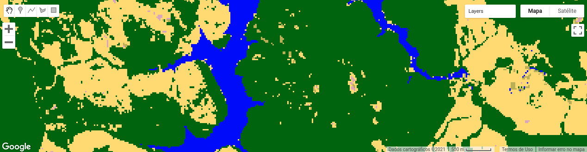

<div class="fluid-row" id="header">
    
    <h1 class="title toc-ignore">MapBiomas Princeton Course</h1>
    <h4 class="author"><em>Tasso Azevedo, Cesar Diniz, Luiz Cortinhas and João Siqueira</em></h4>
</div>


# 3. Post-classification

## 3.1 Spatial Filter
### 3.1.1 Load data

```javascript
// The asset name of classification data
var classificationId = 'users/joaovsiqueira1/mapbiomas-course/spatial-temporal-filter/amazonia-2019';

// Load image classification
var classification = ee.Image(classificationId);

// import the mapbiomas palettes module and get the 'classification5' color scheme
var palette = require('users/mapbiomas/modules:Palettes.js').get('classification5');

print(palette);

// Set a visualization parameter
var visClassification = {
    'min': 0,
    'max': 45,
    'palette': palette,
    'format': 'png'
};

// Add image to map
Map.addLayer(classification, visClassification, 'Classification 2019');
```

[Link](https://code.earthengine.google.com/6dc68d4352fe954eef137c45bd452cee)

### 3.1.2 Use the mapbiomas spatial filter code
This step is not a simple process to do. Thus, here we will have a little more advanced code. The spatial filter aims to reclassify small groups of isolated pixels using information from neighboring pixels. The isolated pixels give the classification a noisy appearance, classically known as the "salt and pepper effect." This technique aims not to change the classification data significantly but to bring a subtle improvement to the final map. Let's study the code below.


```javascript
/**
 * Post-classification spatial filter struct
 * 
 * @param {ee.Image} image [eeObject classification image]
 *
 * @example
 * var image = ee.Image("your image path goes here");
 * var filterParams = [
 *     {classValue: 1, maxSize: 3},
 *     {classValue: 2, maxSize: 5}, // Mapbiomas maximum Size
 *     {classValue: 3, maxSize: 5}, 
 *     {classValue: 4, maxSize: 3},
 *     ];
 * var pc = new PostClassification(image);
 * var filtered = pc.spatialFilter(filterParams);
 */
var PostClassification = function (image) {

    this.init = function (image) {

        this.image = image;

    };

    var majorityFilter = function (image, params) {

        params = ee.Dictionary(params);
        var maxSize = ee.Number(params.get('maxSize'));
        var classValue = ee.Number(params.get('classValue'));

        // Generate a mask from the class value
        var classMask = image.eq(classValue);

        // Labeling the group of pixels until 100 pixels connected
        var labeled = classMask.mask(classMask).connectedPixelCount(maxSize, true);

        // Select some groups of connected pixels
        var region = labeled.lt(maxSize);

        // Squared kernel with size shift 1
        // [[p(x-1,y+1), p(x,y+1), p(x+1,y+1)]
        // [ p(x-1,  y), p( x,y ), p(x+1,  y)]
        // [ p(x-1,y-1), p(x,y-1), p(x+1,y-1)]
        var kernel = ee.Kernel.square(1);

        // Find neighborhood
        var neighs = image.neighborhoodToBands(kernel).mask(region);

        // Reduce to majority pixel in neighborhood
        var majority = neighs.reduce(ee.Reducer.mode());

        // Replace original values for new values
        var filtered = image.where(region, majority);

        return filtered.byte();

    };

    /**
     * Reclassify small blobs of pixels  
     * @param  {list<dictionary>} filterParams [{classValue: 1, maxSize: 3},{classValue: 2, maxSize: 5}]
     * @return {ee.Image}  Filtered Classification Image
     */
    this.spatialFilter = function (filterParams) {

        var image = ee.List(filterParams)
            .iterate(
                function (params, image) {
                    return majorityFilter(ee.Image(image), params);
                },
                this.image
            );

        this.image = ee.Image(image);


        return this.image;

    };

    this.init(image);

};
```
[Link](https://code.earthengine.google.com/07a35e19beced17bad2935048a006f07)

Now, let us see how this code is used inside the MapBiomas structure.

```javascript
// Set a list of spatial filter parameters
// classValue is the representative number of a class and maxSize is the maximum
// size of pixels in a group that will be reclassified
var filterParams = [
    {classValue: 3, maxSize: 5},
    {classValue: 15, maxSize: 5}, 
    {classValue: 33, maxSize: 5}, 
    {classValue: 19, maxSize: 5},
];

var pc = new PostClassification(classification);

var filtered = pc.spatialFilter(filterParams);

// Add image to map
Map.addLayer(filtered.reproject('EPSG:4326', null, 30), visClassification, 'Filtered 2019');
```
<div align=center>
    <caption>
        <h4><strong>Classification before spatial filter</strong></h4>
    </caption>
    <p align="center">
        
    </p>
    <caption>
        <h4><strong>Classification after spatial filter</strong></h4>
    </caption>
    <p align="center">
        
    </p>
</div>

[Link](https://code.earthengine.google.com/1237c86837a94fcc549d9d3e1adf59bb)

### 3.1.3 Export the filtered classification

We performed this procedure for all MapBiomas annual maps. We use some techniques to optimize the Image to Asset export process. Some of them are found on our GitHub.

```javascript
// Export the filtered classification to your asset
Export.image.toAsset({
    image: filtered, 
    description: 'filtered-2019', 
    assetId: 'filtered-2019', 
    pyramidingPolicy: {'.default': 'mode'},
    region: classification.geometry(), 
    scale: 30, 
    maxPixels: 1e13
});
```

## 3.2 Temporal Filter

The temporal filter uses sequential classifications in a three-year unidirectional moving window to identify temporally non-permitted transitions. The temporal filter inspects the central position of three consecutive years (“ternary”), and if the extremities of the ternary are identical but the centre position is not, then the central pixel is reclassified to match its temporal neighbour class.

### 3.2.1 Acessing pre-processed MapBiomas data
:heavy_exclamation_mark: Start a new script.

```javascript
// List of years used in mapbiomas collection 5
var years = [
    '1985', '1986', '1987', '1988', '1989', '1990', '1991', '1992',
    '1993', '1994', '1995', '1996', '1997', '1998', '1999', '2000',
    '2001', '2002', '2003', '2004', '2005', '2006', '2007', '2008',
    '2009', '2010', '2011', '2012', '2013', '2014', '2015', '2016',
    '2017', '2018', '2019'
];

// The classification name prefix in my asset structure
var classificationPrefix = 'users/joaovsiqueira1/mapbiomas-course/spatial-temporal-filter/amazonia-';

// Iterate over years list, concatenate de prefix to year and load as an ee.Image
var classificationList = years.map(
    function(year){
        return ee.Image(classificationPrefix + year).rename('classification_'+ year);
    }
);

// Now see the result
print(classificationList);
```

[Link](https://code.earthengine.google.com/d125276d7ecd0d578bc4b4cd8cfa84ef)

### 3.2.2 Converting the list of images to multiband image

Converting to multi-band may reduce the time taken to export the entire filtered dataset to a GEE Asset.

```javascript
// Create a image collection from the classification list
var classificationCollection = ee.ImageCollection.fromImages(classificationList);

// Prints a image collection
print('classificationCollection:', classificationCollection);

// Convert the classification collection to an image where each year is a band
var classificationMultiBand = classificationCollection.toBands();

print('classificationMultiBand:', classificationMultiBand);
```
[Link](https://code.earthengine.google.com/ceeaabf7945a82312d99b191271ee473)

### 3.2.3 Apply a simple temporal filter rule
Let's apply the three-year unidirectional moving window to identify temporally non-permitted transitions. This is a simplification of the MapBiomas entire filtering process.

```javascript
// Select the data from 2017, 2018 and 2019.
var class2017 = classificationMultiBand.select(['32_classification_2017']);
var class2018 = classificationMultiBand.select(['33_classification_2018']);
var class2019 = classificationMultiBand.select(['34_classification_2019']);
```

Now we need to create some rules using map algebra. Let's focus on three classes: `pasture`, `forest formation` and `agriculture`.

**Class ids:**
- Forest formation: 3
- Pasture: 15
- Agriculture: 19

See the mapbiomas documentation for more information about the legend.

```javascript
// Find pixels where is forest in 2017 and pasture in 2018 and forest in 2019
var rule1 = class2017.eq(3).and(class2018.eq(15)).and(class2019.eq(3));

// Find pixels where is pasture in 2017 and agriculture in 2018 and pasture in 2019
var rule2 = class2017.eq(15).and(class2018.eq(19)).and(class2019.eq(15));

// Reclassify 2018 noise using rule 1 and 2
var filtered2018 = class2018
    .where(rule1, 3)
    .where(rule2, 15);
```

We need our set of visualization parameters again.

```javascript
// import the mapbiomas palettes module and get the 'classification5' color scheme
var palette = require('users/mapbiomas/modules:Palettes.js').get('classification5');

print(palette);

// Set a visualization parameter
var visClassification = {
    'min': 0,
    'max': 45,
    'palette': palette,
    'format': 'png'
};
```

Now we add to the map the classification of the year 2018, before and after the temporal filter.

```javascript
// Add images to map
Map.addLayer(class2018, visClassification, 'Classification 2018');
Map.addLayer(filtered2018, visClassification, 'Filtered 2018');
```
<div align=center>
    <caption>
        <h4><strong>Classification before temporal filter</strong></h4>
    </caption>
    <p align="center">
        
    </p>
    <caption>
        <h4><strong>Classification after temporal filter</strong></h4>
    </caption>
    <p align="center">
        
    </p>
</div>

[Link](https://code.earthengine.google.com/4bb33fe86977177b94e5b3ddac15e0f8)

## 3.3 Calculate area
A spherical or quasi-spherical surface cannot be represented as a plan without some kind of distortions being associated with its representation. That is why the ***Cartographyc Projections*** exist!.

Map projections are mathematical formulations designed to minimize possible distortions, and such distortions can impact your area calculation. Because of this, in GEE, the strategy for calculating areas in a cartographically appropriated way is using a Lambert Azimuthal Equal Area (LAEA)  through the function: ee.Image.pixelArea, as presented in the image below.


```javascript
/**
 * Calculate the class area
 * @param {ee.Image} img, {number} classID
 * @return {ee.Feature} feature with indentified metadata
*/
var areaPerClass =  function(img, classID){
    var area = img
        .rename('area')
        .eq(classID)
        .multiply(ee.Image.pixelArea())
        .reduceRegion({
            reducer: ee.Reducer.sum(),
            geometry: img.geometry(),
            scale: 30,
            maxPixels: 1e13
        });

    return ee.Feature(null, {
        'classId': classID,
        'area_m2': area.get('area')
    });
}
```
Use the function to calculate the classes areas and merge the each ee.Feature as a `ee.FeatureCollection`.
```javascript
var area_3 = areaPerClass(filtered2018,3);
var area_12 = areaPerClass(filtered2018,15);
var area_15 = areaPerClass(filtered2018,15);
var area_19 = areaPerClass(filtered2018,19);
var area_25 = areaPerClass(filtered2018,25);
var area_33 = areaPerClass(filtered2018,33);

// This cast is important to export as a table
var areaCollection = ee.FeatureCollection([
    area_3,
    area_12,
    area_15,
    area_19,
    area_25,
    area_33
]);

print(areaCollection)
```
Now, export to your google drive!.

```javascript
//Exporting...
Export.table.toDrive({
    collection:areaCollection,
    description:'area_perClass_2018',
    fileNamePrefix:'area_perClass_2018',
    folder:'map_stats',
    fileFormat:'csv',
})
```
[Link](https://code.earthengine.google.com/2d5a555f54cec6bd734cb5bf20b6f27b)
<h1 class="title toc-ignore"></h1>
[Mapbiomas Toolkit Sources](https://github.com/mapbiomas-brazil/user-toolkit)

## 3.3 Calculate area for many regions

[Previous: Day 3 - Classification using Random Forest](https://github.com/mapbiomas-brazil/mapbiomas-training/tree/main/Princeton_University/Day_3/README.md) | 
[Next: Day 5 - Identifying Land Use and Land Cover Changes + Applications](https://github.com/mapbiomas-brazil/mapbiomas-training/tree/main/Princeton_University/Day_5/README.md)
