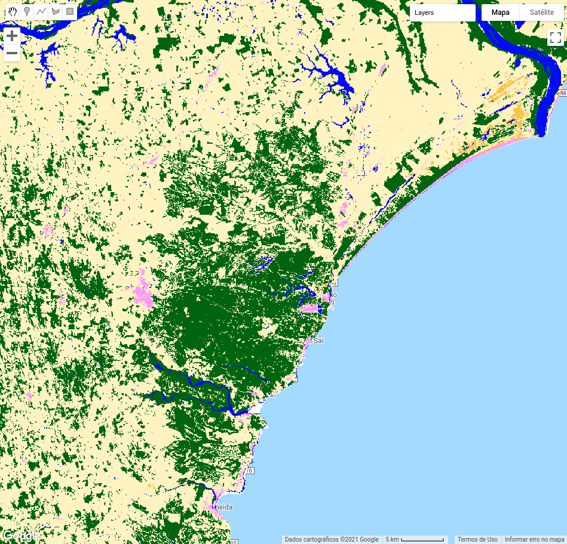
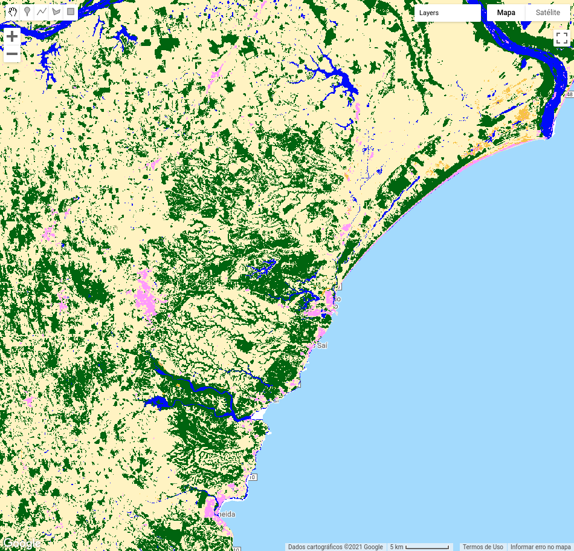
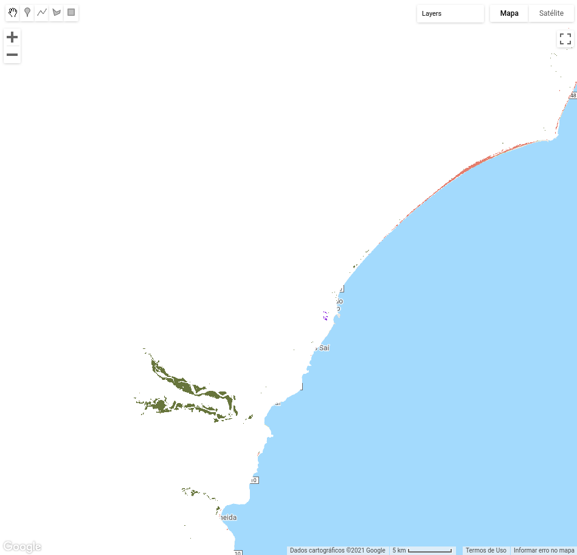
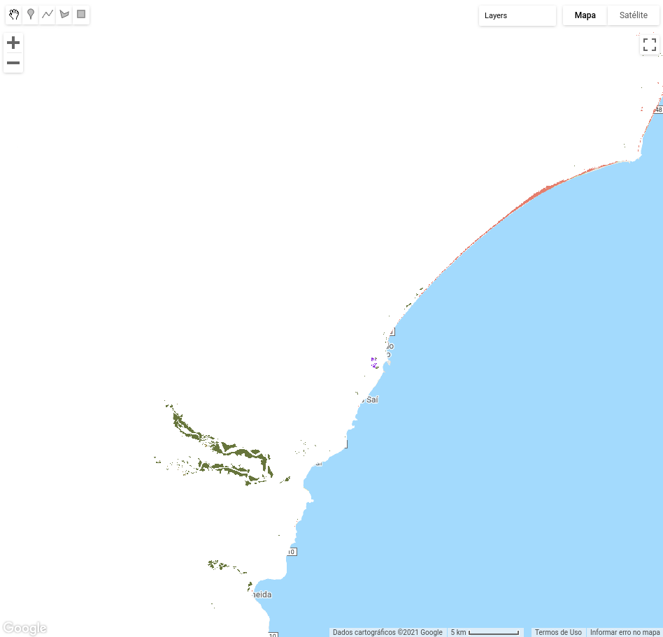

<div class="fluid-row" id="header">
    
    <h1 class="title toc-ignore">MapBiomas Princeton Course</h1>
    <h4 class="author"><em>Tasso Azevedo, Cesar Diniz, Luiz Cortinhas and João Siqueira</em></h4>
</div>

# Concepts of the Day

# 4. Integrating maps

A integração de mapas do mapbiomas é um processo que compila mapas elaborados por equipes especializadas em temas específicos. Esse processo resulta em um mapa com multiplas classes, com detalhamento de diversos temas e acurácia superior.

## 4.1 Acessing MapBiomas data

### 4.1.1 Defining asset ids

Vamos organizar nossos dados de uma forma estruturada para facilitar as coisas.

```javascript
// Assets folder
var assetsFolder = 'users/joaovsiqueira1/mapbiomas-course/integration-transitions';

// Atlantic Forest asset ids
var atlanticForestId2000 = assetsFolder + '/atlantic-forest-2000';
var atlanticForestId2019 = assetsFolder + '/atlantic-forest-2019';

// Pasture asset ids
var pastureId2000 = assetsFolder + '/pasture-2000';
var pastureId2019 = assetsFolder + '/pasture-2019';

// Coastal Zone asset ids
var coastalZoneId2000 = assetsFolder + '/coastal-zone-2000';
var coastalZoneId2019 = assetsFolder + '/coastal-zone-2019';

// Urban Infrastructure asset ids
var urbanId2000 = assetsFolder + '/urban-2000';
var urbanId2019 = assetsFolder + '/urban-2019';
```

### 4.1.2 Load images

Aqui nós estamos lendo as imagens.

```javascript
// Atlantic Forest images
var atlanticForest2000 = ee.Image(atlanticForestId2000);
var atlanticForest2019 = ee.Image(atlanticForestId2019);

// Pasture images
var pasture2000 = ee.Image(pastureId2000);
var pasture2019 = ee.Image(pastureId2019);

// Coastal Zone images
var coastalZone2000 = ee.Image(coastalZoneId2000);
var coastalZone2019 = ee.Image(coastalZoneId2019);

// Urban Infrastructure images
var urban2000 = ee.Image(urbanId2000);
var urban2019 = ee.Image(urbanId2019);
```

### 4.1.3 Add data to map

Vamos preparar o ambiente para a visualização dos dados

```javascript
// import the mapbiomas palettes module and get the 'classification5' color scheme
var palette = require('users/mapbiomas/modules:Palettes.js').get('classification5');

print(palette);

// Set a visualization parameter
var visClassification = {
    'min': 0,
    'max': 45,
    'palette': palette,
    'format': 'png'
};
```

Agora, vamos entender um pouco nossos dados.

```javascript
// Add Atlantic Forest data to map
Map.addLayer(atlanticForest2000, visClassification, 'Atlantic Forest 2000');
Map.addLayer(atlanticForest2019, visClassification, 'Atlantic Forest 2019');

// Add Atlantic Forest data to map
Map.addLayer(coastalZone2000, visClassification, 'Coastal Zone 2000');
Map.addLayer(coastalZone2019, visClassification, 'Coastal Zone 2019');

// Add Atlantic Forest data to map
Map.addLayer(pasture2000, visClassification, 'Pasture 2000');
Map.addLayer(pasture2019, visClassification, 'Pasture 2019');

// Add Atlantic Forest data to map
Map.addLayer(urban2000, visClassification, 'Urban Infrastructure 2000');
Map.addLayer(urban2019, visClassification, 'Urban Infrastructure 2019');
```

<!-- <!DOCTYPE html>
<div class="box">
    
    <span> Atlantic Forest 2000 </span>
</div>
<div class="box">
    
    <span> Atlantic Forest 2019 </span>
</div>
<div class="box">
    
    <span> Coastal Zone 2000 </span>
</div>
<div class="box">
    
    <span> Coastal Zone 2019 </span>
</div>

<style>
    div.box {
        /* width: 25.0%; */
        display: inline-block;
    }
</style> -->

Solarized dark             |  Solarized Ocean          |Solarized dark             |  Solarized Ocean
:-------------------------:|:-------------------------:|:-------------------------:|:-------------------------:
  |    |  