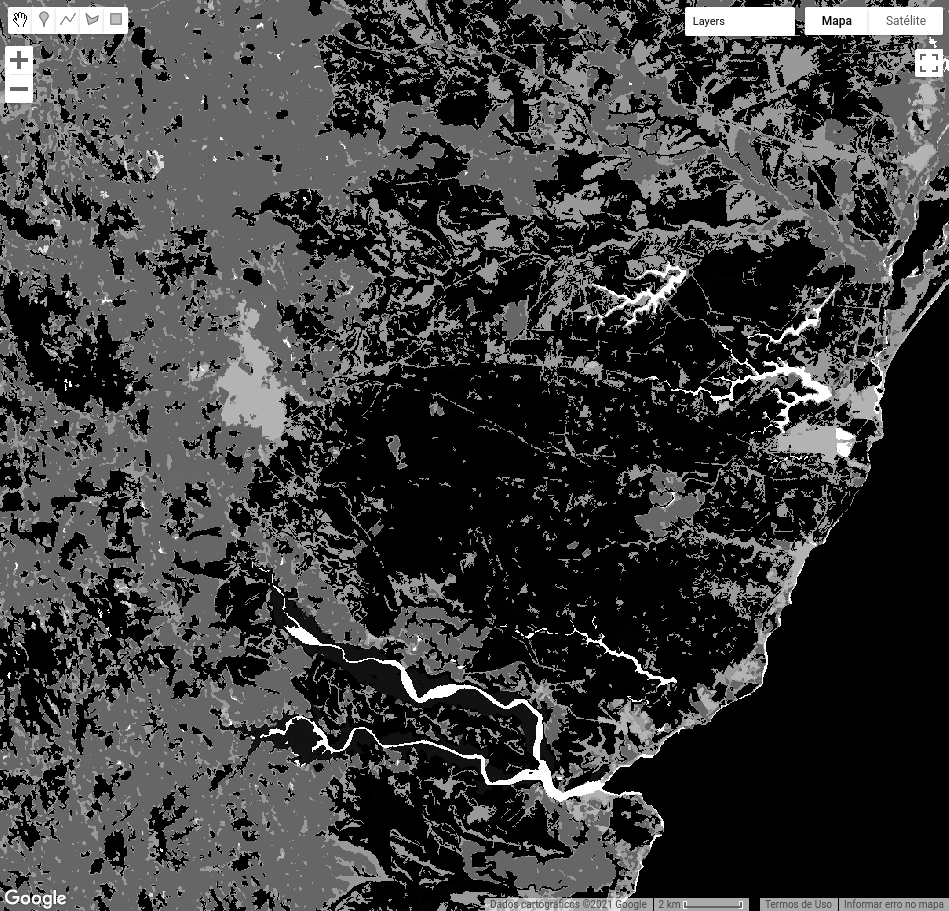

<div class="fluid-row" id="header">
    
    <h1 class="title toc-ignore">MapBiomas Princeton Course</h1>
    <h4 class="author"><em>Tasso Azevedo, Cesar Diniz, Luiz Cortinhas and João Siqueira</em></h4>
</div>


# 4 Integrating maps

The integration is a process that compiles/overlaps classifications prepared by different teams that are specialized in specific themes. This process results in a map with multiple classes, detailing different themes and superior accuracy.

## 4.1 Acessing MapBiomas data

### 4.1.1 Defining asset ids

To make things easier, we will organize our data in a structured way.

```javascript
// Assets folder
var assetsFolder = 'users/joaovsiqueira1/mapbiomas-course/integration-transitions';

// Atlantic Forest asset ids
var atlanticForestId2000 = assetsFolder + '/atlantic-forest-2000';
var atlanticForestId2019 = assetsFolder + '/atlantic-forest-2019';

// Pasture asset ids
var pastureId2000 = assetsFolder + '/pasture-2000';
var pastureId2019 = assetsFolder + '/pasture-2019';

// Coastal Zone asset ids
var coastalZoneId2000 = assetsFolder + '/coastal-zone-2000';
var coastalZoneId2019 = assetsFolder + '/coastal-zone-2019';

// Urban Infrastructure asset ids
var urbanId2000 = assetsFolder + '/urban-2000';
var urbanId2019 = assetsFolder + '/urban-2019';
```

### 4.1.2 Load images

Lets load our images in pair of years.

```javascript
// Atlantic Forest images
var atlanticForest2000 = ee.Image(atlanticForestId2000);
var atlanticForest2019 = ee.Image(atlanticForestId2019);

// Pasture images
var pasture2000 = ee.Image(pastureId2000);
var pasture2019 = ee.Image(pastureId2019);

// Coastal Zone images
var coastalZone2000 = ee.Image(coastalZoneId2000);
var coastalZone2019 = ee.Image(coastalZoneId2019);

// Urban Infrastructure images
var urban2000 = ee.Image(urbanId2000);
var urban2019 = ee.Image(urbanId2019);
```

### 4.1.3 Add data to map

Let's prepare the environment for data visualization

```javascript
// import the mapbiomas palettes module and get the 'classification5' color scheme
var palette = require('users/mapbiomas/modules:Palettes.js').get('classification5');

print(palette);

// Set a visualization parameter
var visClassification = {
    'min': 0,
    'max': 45,
    'palette': palette,
    'format': 'png'
};
```

<a href="https://mapbiomas-br-site.s3.amazonaws.com/_PT-BR__C%C3%B3digos_da_legenda_Cole%C3%A7%C3%A3o_5.pdf" target="_blank">
    
</a>

Now, let's understand our data a little.

```javascript
// Add Atlantic Forest data to map
Map.addLayer(atlanticForest2000, visClassification, 'Atlantic Forest 2000');
Map.addLayer(atlanticForest2019, visClassification, 'Atlantic Forest 2019');

// Add Costal Zone data to map
Map.addLayer(coastalZone2000, visClassification, 'Coastal Zone 2000');
Map.addLayer(coastalZone2019, visClassification, 'Coastal Zone 2019');

// Add Pasture data to map
Map.addLayer(pasture2000, visClassification, 'Pasture 2000');
Map.addLayer(pasture2019, visClassification, 'Pasture 2019');

// Add Urban Infrasctructure data to map
Map.addLayer(urban2000, visClassification, 'Urban Infrastructure 2000');
Map.addLayer(urban2019, visClassification, 'Urban Infrastructure 2019');
```

Theme                           |Year 2000                               |Year 2019
:------------------------------:|:--------------------------------------:|:--------------------------------------:
**Atlantic Forest**             ||
**Coastal Zone**                |   |
**Pasture**                     |        |
**Urban Infrastructure**        |          |

## 4.2 Define an integration function

Let's define a function to integrate the maps.

```javascript
/**
 * Integrated the mapbiomas thematic maps
 * 
 * @param {object} data {biome, pasture, coasta_zone, urban}
 *
 * @return {ee.Image} integrated
 */
var integrate = function(data){

    // Crosscuting themes classes
    var pasture = data.pasture.eq(15);
    var urban = data.urban.eq(24);
    var mangrove = data.coastal_zone.eq(5);
    var beach = data.coastal_zone.eq(23);

    // Biome classes
    var forest = data.biome.eq(3);
    var agricultureOrPasture = data.biome.eq(21);
    var nonNaturalForestFormation = data.biome.eq(13);
    var notVegetatedArea = data.biome.eq(25);
    var water = data.biome.eq(33);
    var rock = data.biome.eq(29);

    // Start an empty image
    var integrated = ee.Image(0);

    // Apply basic integration rules
    integrated = integrated.where(agricultureOrPasture, 21);
    integrated = integrated.where(pasture, 15);
    integrated = integrated.where(nonNaturalForestFormation, 13);
    integrated = integrated.where(forest, 3);
    integrated = integrated.where(water, 33);
    integrated = integrated.where(notVegetatedArea, 25);
    integrated = integrated.where(rock, 29);
    integrated = integrated.where(urban, 24);
    integrated = integrated.where(mangrove, 5);
    integrated = integrated.where(beach, 23);

    return integrated;
};
```

Now, let's apply the `integrate()` function and generate the integrated maps for the years 2000 and 2019.

```javascript
var data2000 = {
    'biome': atlanticForest2000,
    'pasture': pasture2000,
    'coastal_zone': coastalZone2000,
    'urban': urban2000,
};

var integrated2000 = integrate(data2000);

var data2019 = {
    'biome': atlanticForest2019,
    'pasture': pasture2019,
    'coastal_zone': coastalZone2019,
    'urban': urban2019,
};

var integrated2019 = integrate(data2019);
```

Let's see the result of our integration.

```javascript
// Add integrated data to map
Map.addLayer(integrated2000, visClassification, 'Integrated 2000');
Map.addLayer(integrated2019, visClassification, 'Integrated 2019');
```

Theme                           |Year 2000                               |Year 2019
:------------------------------:|:--------------------------------------:|:------------------------------------:
**Integrated**                  |       |

# 5 Transitions maps

Once we have the maps integrated, we can compare them and create a transition map.

## 5.1 Define a function to generate the transition map
```javascript
/**
 * Generate transitions map
 * 
 * @param {ee.Image} imageT0
 * @param {ee.Image} imageT1
 *
 * @return {ee.Image} transitions
 */
var generateTransitions = function(imageT0, imageT1){

    // Algebraic solution to generate transitions map
    var transitions = imageT0.multiply(100).add(imageT1);

    return transitions;
};
```
## 5.1 Apply the transitions function

Now, let's apply the `generateTransition()` function and generate the transition map between the years 2000 and 2019.

```javascript
var transitions = generateTransitions(integrated2000, integrated2019);

transitions = transitions.rename('transitions_2000_2019')
                         .selfMask();
```

## 5.2 Add transitions to map

```javascript
// set a visualization parameters to transitions map
var visTransition = {
    'min': 303,
    'max': 3333,
    'format': 'png'
};

// Add transitions to map
Map.addLayer(transitions, visTransition, 'Transitions 2000-2019');
```
Integrated 2000                  |Integrated 2019                  |Transitions 2000-2019        
:-------------------------------:|:-------------------------------:|:---------------------------:
||

## 5.3 Explore the transition data
### 5.3.1 Vegetation loss
```javascript
//
var vegetationLossIds = [
        321, // forest to agriculture or pasture
        315, // forest to pasture
        325, // forest to not vegetated areas
        324  // forest to urban
    ];

var vegetationLoss = transitions.remap(
    vegetationLossIds, 
    ee.List.sequence(1, vegetationLossIds.length),
    0
);

// set a visualization parameters to transitions map
var visVegetationLoss = {
    'min': 0,
    'max': 1,
    'format': 'png',
    'palette': '20242E,ff0000'
};

// Add transitions to map
Map.addLayer(vegetationLoss, visVegetationLoss, 'Vegetation Loss 2000-2019');
```

Integrated 2000                  |Integrated 2019                  |Vegegtation Loss 2000-2019       
:-------------------------------:|:-------------------------------:|:-------------------------------:
||

### 5.3.1 Vegetation gain
```javascript
//
var vegetationGainIds = [
        2103, // agriculture or pasture to forest
        1503, // pasture to forest
        2503, // not vegetated areas to forest
        2403  // urban to forest
    ];

var vegetationGain = transitions.remap(
    vegetationGainIds, 
    ee.List.sequence(1, vegetationGainIds.length),
    0
);

// set a visualization parameters to transitions map
var visVegetationGain = {
    'min': 0,
    'max': 1,
    'format': 'png',
    'palette': '20242E,00ff00'
};

// Add transitions to map
Map.addLayer(vegetationGain, visVegetationGain, 'Vegetation Gain 2000-2019');
```

Integrated 2000                  |Integrated 2019                  |Vegetation Gain 2000-2019
:-------------------------------:|:-------------------------------:|:--------------------------------:
||

### 5.3.1 Water gain
```javascript
//
var waterGainIds = [
        333,  // forest to water
        533,  // mangrove to water
        2133, // agriculture or pasture to water
        1533, // pasture to water
        2533, // not vegetated areas to water
        2433  // urban to water
    ];

var waterGain = transitions.remap(
    waterGainIds, 
    ee.List.sequence(1, waterGainIds.length),
    0
);

// set a visualization parameters to transitions map
var viswaterGain = {
    'min': 0,
    'max': 1,
    'format': 'png',
    'palette': '20242E,00ff00'
};

// Add transitions to map
Map.addLayer(waterGain, viswaterGain, 'Water Gain 2000-2019');
```

Integrated 2000                  |Integrated 2019                  |Vegetation Gain 2000-2019
:-------------------------------:|:-------------------------------:|:--------------------------------:
||
