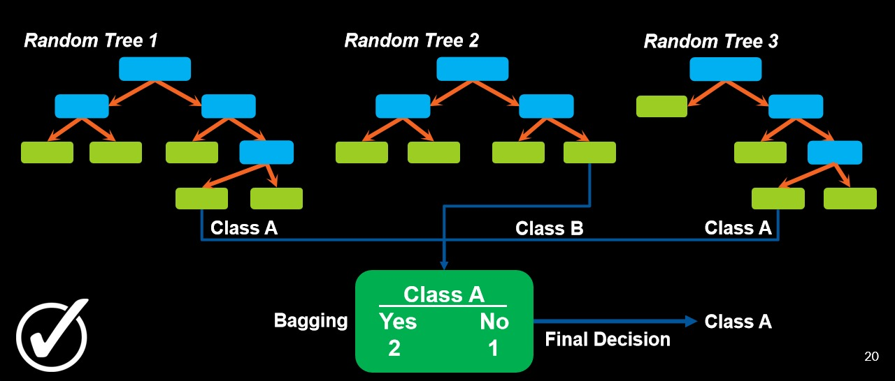
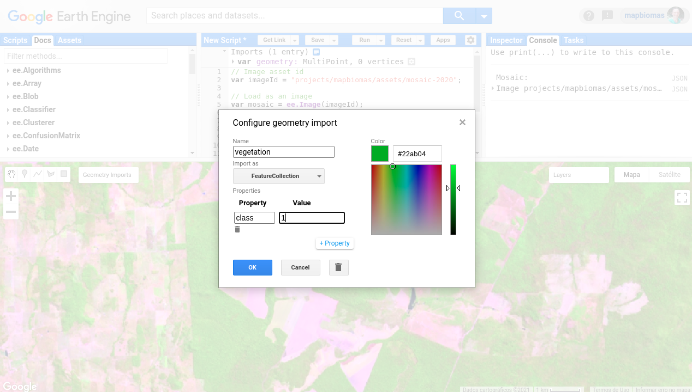
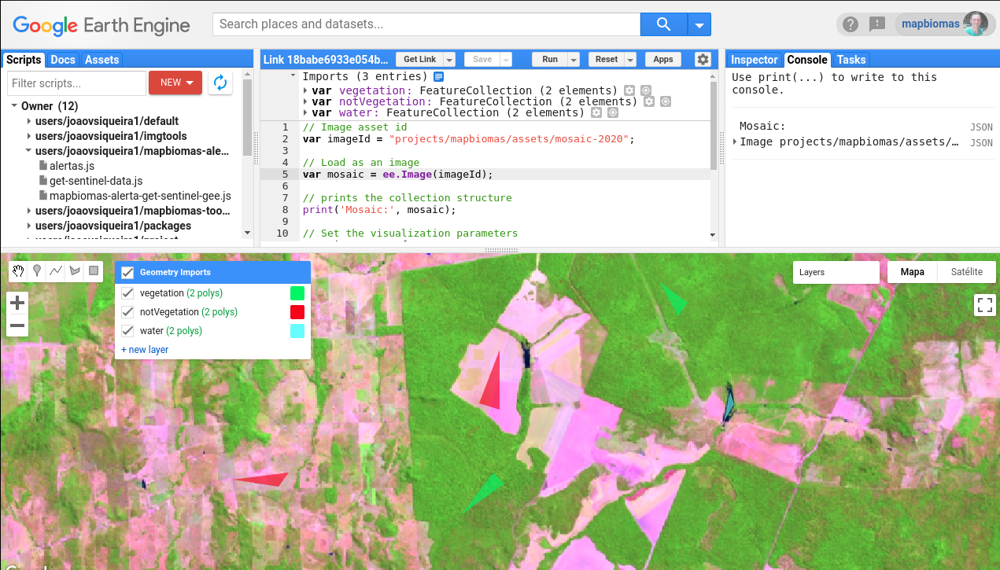
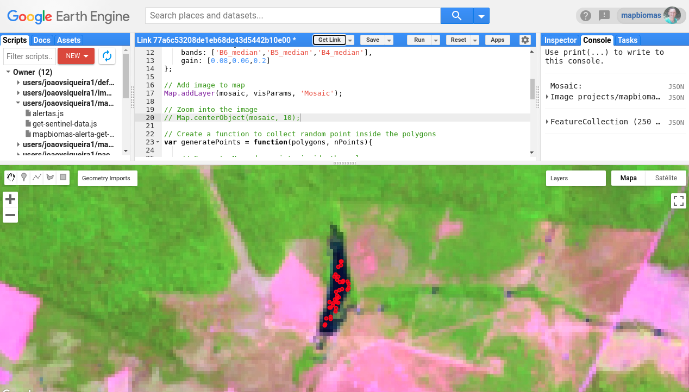

<div class="fluid-row" id="header">
    
    <h1 class="title toc-ignore">MapBiomas Princeton Course</h1>
    <h4 class="author"><em>Tasso Azevedo, Cesar Diniz, Luiz Cortinhas and João Siqueira</em></h4>
</div>

# Concepts of the Day
**Random Forest**: Random Forest is a supervised classifier, made up of decision trees, which uses statistical concepts such as **randomness** and **majority** decision, to add more flexibility to the classifier.

<p align="center">
    
</p>

If you want more details, check this Youtube Video: [StatQuest - Random Forest](https://youtu.be/J4Wdy0Wc_xQ)

**Variability**: Generally speaking, variability is how spread out or closely clustered a set of data is. In this sense, when capturing samples to train a supervised algorithm, the variability concept must always be in our minds. Let's think of beaches along a coastline; 

A beach is most often a white and shiny sand surface, but that is not always true. Along the US or Brazil coasts, there are variations of this pattern. The geochemistry of sediments, humidity levels, and geological origin are all variables that influence the beach's spectral patterns.  A good classifier must be capable of capturing such variability.

# 2. Classification using Random Forest
In this session we will learn how to load an image, collect samples, train a random forest model and perform the classification.

## 2.1. Load data from asset

### 2.1.1. Load the mosaic as an ee.Image

Use `ee.Image()` function to load the image mosaic.

```javascript
// Choose an image asset id
var imageId = "users/joaovsiqueira1/mapbiomas-course/mosaic-2020";
// var imageId = "users/joaovsiqueira1/mapbiomas-course/africa-2020";
// var imageId = "users/joaovsiqueira1/mapbiomas-course/congo-2020";
// var imageId = "users/joaovsiqueira1/mapbiomas-course/miami-2020";
// var imageId = "users/joaovsiqueira1/mapbiomas-course/new-zeland-2020";
// var imageId = "users/joaovsiqueira1/mapbiomas-course/peru-2020";
// var imageId = "users/joaovsiqueira1/mapbiomas-course/puerto-rico-2020";
// var imageId = "users/joaovsiqueira1/mapbiomas-course/rondonia-brazil-2020";
// var imageId = "users/joaovsiqueira1/mapbiomas-course/san-francisco-2020";
// var imageId = "users/joaovsiqueira1/mapbiomas-course/santarem-brazil-2020";
// var imageId = "users/joaovsiqueira1/mapbiomas-course/sri-lanka-2020";
// var imageId = "users/joaovsiqueira1/mapbiomas-course/mosaic-2020";

// Load as an image
var mosaic = ee.Image(imageId);

// prints the collection structure
print('Mosaic:', mosaic);
```

### 2.2. Add mosaic to map
```javascript
// Set the visualization parameters
var visParams = {
    bands: ['B6_median','B5_median','B4_median'],
    gain: [0.08,0.06,0.2]
};

// Add image to map
Map.addLayer(mosaic, visParams, 'Mosaic');

// Zoom into the image
Map.centerObject(mosaic, 9);
```

[Link](https://code.earthengine.google.com/a0651d74137aec7017cb6c027e17ddd9)

## 2.2. Collect manual samples
### 2.2.1. Create a feature collection

In this example, we will classify three land cover classes: `vegetation, not vegetation and water`. For this, it is necessary to collect samples for each class. Using the code editor's shape editing tool , we will create three sets of `polygons` and import them as` FeatureCollection`. We will also add a name for each set of geometries. 

The script is prepared to accept the names: `vegetation`,` notVegetation` and `water`. In each set, a property called `class` will be added that will receive a value of 1, 2 or 3 for vegetation, notVegetation and water respectively. You can choose a reference color for each class. See the figure below:



Sample collection results in a set of polygons similar to what we see in the next figure:


[Link](https://code.earthengine.google.com/18babe6933e054bc7dbc357c255d27b5)

## 2.3. Generate random points

After collecting samples, we need to generate random points within these regions. The proper distribution of the sampling polygons, plus the random distribution inside it, helps us capture the class variability. In this session, we present a function to distribute random points within the polygons defined earlier.

```javascript
// Create a function to collect random point inside the polygons
var generatePoints = function(polygons, nPoints){
    
    // Generate N random points inside the polygons
    var points = ee.FeatureCollection.randomPoints(polygons, nPoints);
    
    // Get the class value propertie
    var classValue = polygons.first().get('class');
    
    // Iterate over points and assign the class value
    points = points.map(
        function(point){
            return point.set('class', classValue);
        }
    );
    
    return points;
};
```

Then, we use this function to collect the points in each group of polygons created. Note that the function takes two arguments: `polygons` and` nPoints`. These arguments are the `drawn polygons` and the` number of points we want to collect.` There are other, more accurate ways to define the number of points to be collected. For example, we can determine the size of the set of points using as a reference the proportion of the known area of your region of interest `ROI`. The purpose of this tutorial is to show an introductory approach, and that is why we are empirically defining 100 points for `vegetation,` 100 points for` notVegetation`, and 50 points for `water.`

```javascript
// Collect random points inside your polygons
var vegetationPoints = generatePoints(vegetation, 100);

var notVegetationPoints = generatePoints(notVegetation, 100);

var waterPoints = generatePoints(water, 50);
```

To use acquired points/samples as training data, it is necessary to join the three sets in a single collection.

```javascript
// Merge all samples into a featureCollection
var samples = vegetationPoints.merge(notVegetationPoints).merge(waterPoints);

print(samples);

Map.addLayer(samples, {color: 'red'}, 'samples');
```


## 2.4. Collect the spectral information

Once we have the samples for the defined classes, we need to capture the spectral information in its pixels 

```javascript
// Collect the spectral information to get the trained samples
var trainedSamples = mosaic.reduceRegions({
    'collection': samples, 
    'reducer': ee.Reducer.first(), 
    'scale': 30,
  });

trainedSamples = trainedSamples.filter(ee.Filter.notNull(['B2_max']));

print(trainedSamples);
```

:heavy_exclamation_mark: Now check the console, and besides the property `class`, the points/samples are presenting the pixel value of each band.

<p align="center">
    
</p>

[Link](https://code.earthengine.google.com/db2b9bff4e672fc6f078e3aa6f170383)

## 2.5. Training the Random Forest classifier

We will use the `ee.Classifier.smileRandomForest()` function to configure our Random Forest model. The documentation for this function teaches us that we can configure the following set of parameters::

**Arguments:**
- **numberOfTrees (Integer)**: The number of decision trees to create.
- **variablesPerSplit (Integer, default: null)**: The number of variables per split. If unspecified, uses the square root of the number of variables.
- **minLeafPopulation (Integer, default: 1)**: Only create nodes whose training set contains at least this many points.
- **bagFraction (Float, default: 0.5)**: The fraction of input to bag per tree.
- **maxNodes (Integer, default: null)**: The maximum number of leaf nodes in each tree. If unspecified, defaults to no limit.
- **seed (Integer, default: 0)**: The randomization seed.

Vamos configurar apenas a variável `numberOfTrees` neste exercício.

```javascript
// Set up the Random Forest classifier
var classifier = ee.Classifier.smileRandomForest({
    'numberOfTrees': 50
});
```

Our model is configured, but we still need to train it with the sample points we selected. In this step, we use the `train()` function and will receive at least three arguments: `features`, `classProperties` and `inputProperties`. In `features`, we insert the variable `trainedSamples` that stores our points containing the class value and the pixel value in all bands. We define `classProperties` equal to 'class', because it is the property that stores the point's class number value. Finally, we insert in `inputProperties` a list with the names of the bands that we will use to train the classifier. We are using all the median, minimum, and maximum bands, but feel free to test the combination you want. There is a more robust method to define each band's relevance within the Random Forest training model. Let's speak of attribute/band relevance in future opportunities! That's all for today!

```javascript
// Training the classifier
classifier = classifier.train({
    'features': trainedSamples, 
    'classProperty': 'class', 
    'inputProperties': [
        'B2_max',
        'B2_median',
        'B2_min',
        'B3_max',
        'B3_median',
        'B3_min',
        'B4_max',
        'B4_median',
        'B4_min',
        'B5_max',
        'B5_median',
        'B5_min',
        'B6_max',
        'B6_median',
        'B6_min',
        'B7_max',
        'B7_median',
        'B7_min',
        'evi_max',
        'evi_median',
        'evi_min',
        'ndvi_max',
        'ndvi_median',
        'ndvi_min',
        'ndwi_max',
        'ndwi_median',
        'ndwi_min',
    ]
    });
```
[Link](https://code.earthengine.google.com/98f19e617c7ff534db890cff5a3d072e)

## 2.6. Run the classifier

Para executar a classificação usamos a função `classify()` e passamos como argumento o modelo Random Forest treinado.

```javascript
// Run the Random Forest classifier
var classification = mosaic.classify(classifier);

// Add classification to map
Map.addLayer(classification, {
        'min': 0,
        'max': 3,
        'palette': ['ffffff,00aa00,ff0000,0000ff'],
        'format': 'png'
    },
    'classification'
);
```


[Link](https://code.earthengine.google.com/69f685ee6b0426a5c27ac5007bc4670b)

## 2.7. Export classification to asset

```javascript
// Export the classification to your asset
Export.image.toAsset({
    image: classification, 
    description: 'classification-2020', 
    assetId: 'classification-2020', 
    pyramidingPolicy: {'.default': 'mode'}, // use mode for classification data
    region: classification.geometry(), 
    scale: 30, 
    maxPixels: 1e13
});
```

[Link](https://code.earthengine.google.com/f8d9de8e8b0af476c7eb6402746d8e63)

[Previous: Day 2 - Accessing Satellite Images and Creating Mosaics](https://github.com/mapbiomas-brazil/mapbiomas-training/tree/main/Princeton_University/Day_2/README.md) | [Next: Day 4 - Spatial filter, Temporal Filter and Area Calculation](https://github.com/mapbiomas-brazil/mapbiomas-training/tree/main/Princeton_University/Day_4/README.md)
